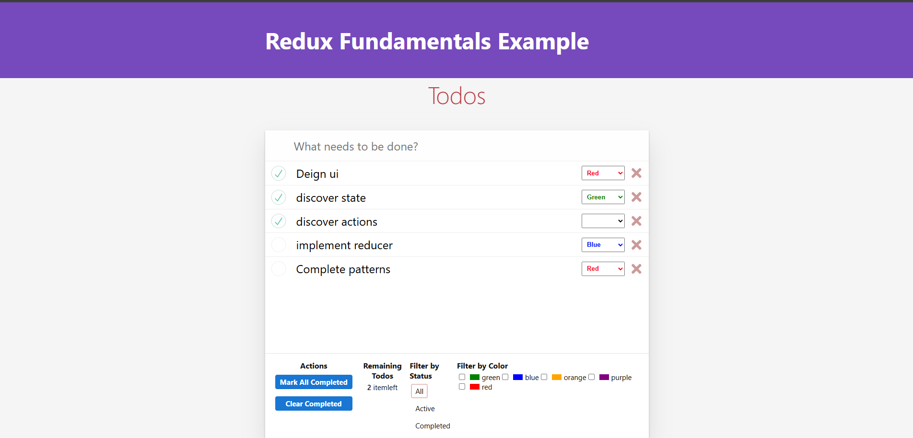

# 📝 Redux Fundamentals Example – Todo List

This project is a simple **Todo List** app built to demonstrate the core concepts of **Redux**. It's designed for beginners who want to understand how Redux works with state management in a React application.

---

## 🚀 Features

- Add new todos
- Toggle todo completion
- Filter todos by status (All, Active, Completed)
- Filter by Color
- Delete todos

---

## 📌 Key Concepts Covered

- How to set up a Redux store
- Dispatching actions and updating state
- Using selectors to access state
- Connecting Redux to React components

---

## 🛠 Technologies Used

- **React**
- **Redux**
- **React-Redux**
- **JavaScript (ES6+)**

---

## ⚙️ Installation

1. **Clone the repo:**

   ```bash
   git clone https://github.com/shrMohtashm/todoListWithRedux.git
   ```

2. **Install dependencies:**

   ```bash
   npm install
   ```

3. **Start the development server:**

   ```bash
   npm start
   ```

4. **Open your browser and navigate to http://localhost:3000.**

---

## 📸 Preview



---
